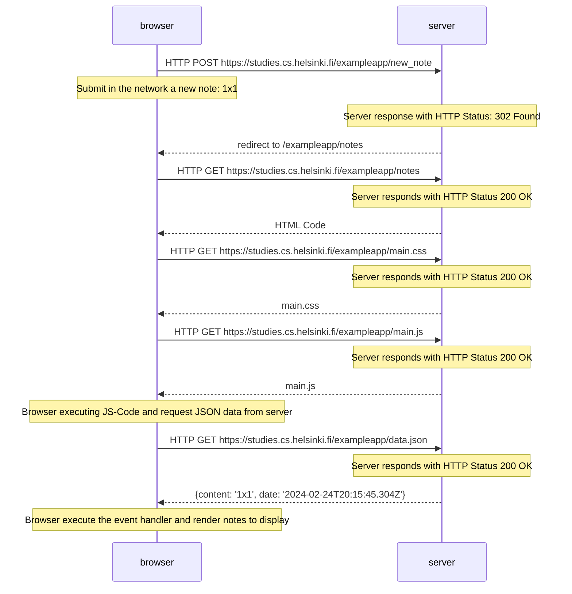
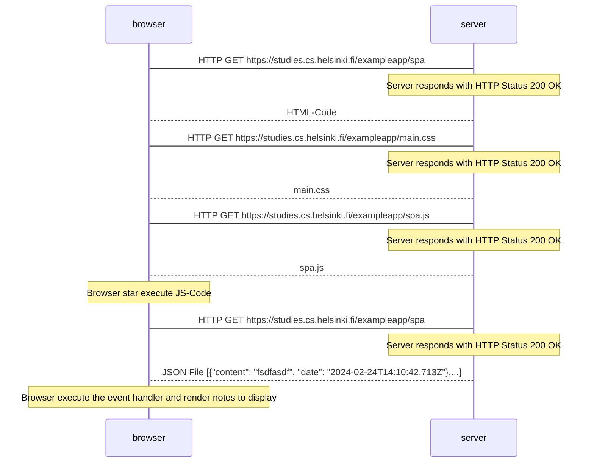
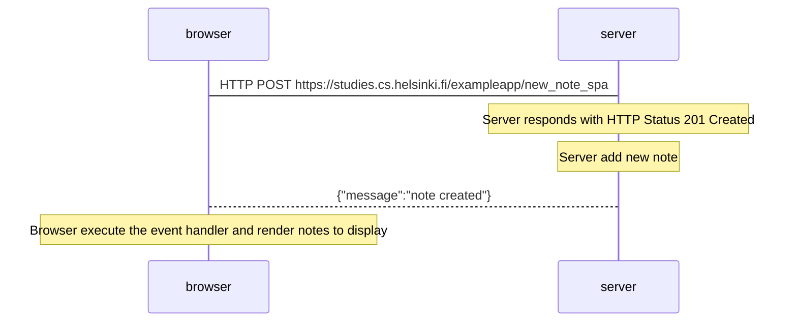

# Ejercicios 0.1.-0.6.

- **0.1:** HTML (online content) :heavy_check_mark:	
- **0.2:** CSS (online content) :heavy_check_mark:	
- **0.3:** HTML forms (online content) :heavy_check_mark:	

- **0.4:** New note diagram / Nuevo diagrama de nota

- **0.5**: Single page app diagram / Diagrama de aplicación de una sola página
  

 - **0.6**: New note in Single page app diagram / Nueva nota en diagrama aplicación de una sola página

